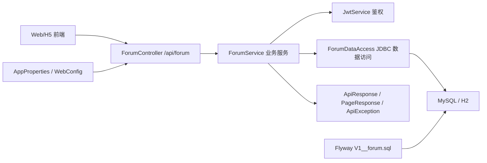
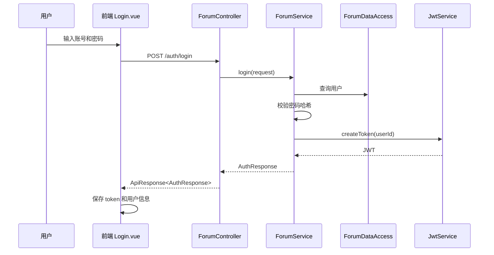
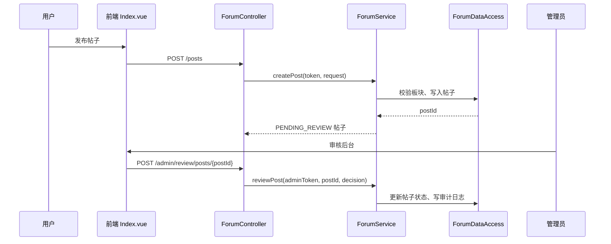
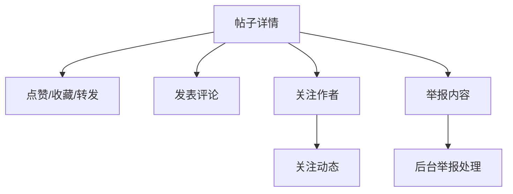
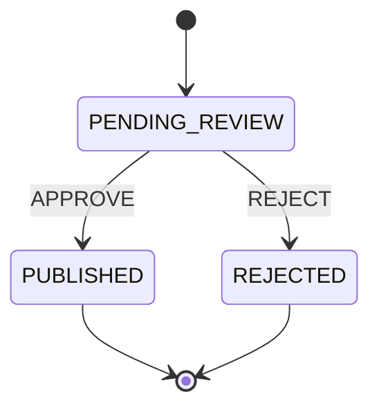

# 股票基金投资论坛架构与类设计文档

## 1. 系统概述

股票基金投资论坛采用前后端分离架构：

- 前端：Vue 3 + Vite + uni-app H5。
- 后端：Spring Boot 2.7 单体应用。
- 数据库：MySQL，测试环境使用 H2 MySQL 模式。
- 数据迁移：Flyway。
- 鉴权：JWT Bearer Token。
- API 根路径：`/api/forum`。

系统围绕论坛业务域组织，提供注册登录、个人资料、认证申请、风险评估、板块、帖子、评论、互动、关注、搜索、群组、私信、举报、审核、用户管理、敏感词管理和运营仪表盘能力。

## 2. 总体架构



## 3. 后端分层设计

后端包结构：

```text
com.stock.forum
├── StockForumApplication.java
├── auth
│   └── JwtService.java
├── common
│   ├── ApiException.java
│   ├── ApiResponse.java
│   ├── GlobalExceptionHandler.java
│   └── PageResponse.java
├── config
│   ├── AppProperties.java
│   └── WebConfig.java
├── controller
│   └── ForumController.java
├── dto
│   └── ForumDtos.java
├── repository
│   └── ForumDataAccess.java
└── service
    └── ForumService.java
```

### 3.1 Controller 层

类：`ForumController`

职责：

- 接收 `/api/forum` 下的全部 HTTP 请求。
- 解析请求体、路径参数、查询参数和 `Authorization` 请求头。
- 调用 `ForumService` 完成业务处理。
- 使用 `ApiResponse<T>` 统一包装响应。

接口分组：

| 分组 | 路径前缀 | 功能 |
| --- | --- | --- |
| 认证 | `/auth` | 注册、登录、当前用户 |
| 用户 | `/users` | 资料、认证、风险评估 |
| 板块 | `/boards` | 板块查询 |
| 帖子 | `/posts` | 发帖、详情、评论、互动 |
| 举报 | `/reports` | 用户举报 |
| 社交 | `/social` | 关注、关注动态 |
| 搜索 | `/search` | 综合搜索、代码联想 |
| 群组 | `/groups` | 群组查询、创建、加入 |
| 私信 | `/messages` | 发送私信、查询会话 |
| 后台 | `/admin` | 仪表盘、审核、举报、用户、板块、敏感词 |

### 3.2 Service 层

类：`ForumService`

职责：

- 实现论坛业务规则。
- 执行注册登录、密码哈希、资料更新、认证申请、风险评估。
- 执行板块管理、帖子发布、帖子审核、评论、点赞收藏转发。
- 执行关注、关注动态、群组、私信、举报处理。
- 执行管理员权限校验、用户违规处理、敏感词管理、运营统计。
- 在启动时初始化演示用户和示例内容。

核心方法设计：

| 方法 | 业务职责 |
| --- | --- |
| `register` | 注册用户，校验账号唯一性，创建密码盐和密码哈希 |
| `login` | 登录校验，生成 JWT |
| `me` | 查询当前用户资料、发帖数、粉丝数、关注数 |
| `updateProfile` | 更新昵称、头像、简介、经验标签、关注市场和隐私 |
| `submitVerification` | 写入认证申请，基础认证直接批准 |
| `completeRiskAssessment` | 写入风险评估记录，更新适当性状态 |
| `listBoards` | 查询启用板块或全部板块 |
| `createBoard/updateBoard/deleteBoard` | 管理后台板块管理 |
| `createPost` | 创建帖子，进入审核流程，执行敏感词命中记录 |
| `getPost` | 查询帖子详情，增加浏览量，返回评论和用户互动状态 |
| `createComment` | 创建评论，更新帖子评论数 |
| `interact` | 点赞、收藏、转发及计数维护 |
| `report` | 创建举报记录 |
| `follow` | 关注、特别关注、取消关注 |
| `followingFeed` | 查询关注用户的帖子动态 |
| `search/suggest` | JDBC 搜索帖子、用户、股票/基金代码 |
| `createGroup/joinGroup/listGroups` | 群组创建、加入和查询 |
| `sendMessage/listMessages` | 私信发送和会话查询 |
| `adminDashboard` | 后台统计和热门内容 |
| `adminReviewPosts/reviewPost` | 审核队列和帖子审核 |
| `listReports/resolveReport` | 举报列表和举报处理 |
| `listUsers/applyViolation` | 用户列表和违规处理 |
| `listSensitiveWords/createSensitiveWord/deleteSensitiveWord` | 敏感词管理 |

事务边界：

- 写操作使用 `@Transactional`。
- 注册、资料更新、认证、风险评估、板块管理、发帖、评论、互动、举报、关注、群组、私信、审核、违规处理、敏感词管理均在事务内完成。

### 3.3 Repository 层

类：`ForumDataAccess`

职责：

- 封装 `JdbcTemplate`。
- 提供统一查询、单行查询、计数、更新、插入和参数列表辅助方法。
- 插入操作返回数据库生成主键。
- 查询结果统一从下划线字段转为驼峰字段。
- 时间字段统一格式化为 `yyyy-MM-dd HH:mm:ss`。

方法：

| 方法 | 说明 |
| --- | --- |
| `query(String sql, Object... args)` | 查询多行 |
| `queryOne(String sql, Object... args)` | 查询单行，返回 `Optional` |
| `count(String sql, Object... args)` | 查询计数 |
| `update(String sql, Object... args)` | 执行更新、删除 |
| `insert(String sql, Object... args)` | 执行插入并返回主键 |
| `args(Object... values)` | 构造可变参数列表 |
| `now()` | 当前时间戳 |

### 3.4 DTO 层

类：`ForumDtos`

职责：

- 定义接口请求体和认证响应结构。
- 与 Controller 请求体直接绑定。

DTO 列表：

| DTO | 用途 |
| --- | --- |
| `RegisterRequest` | 注册请求 |
| `LoginRequest` | 登录请求 |
| `AuthResponse` | 注册/登录响应 |
| `ProfileRequest` | 资料更新 |
| `BoardRequest` | 板块创建和更新 |
| `PostRequest` | 发帖 |
| `CommentRequest` | 评论 |
| `InteractionRequest` | 点赞、收藏、转发 |
| `ReportRequest` | 举报 |
| `ReviewRequest` | 审核、处理 |
| `VerificationRequest` | 认证申请 |
| `RiskAssessmentRequest` | 风险评估 |
| `GroupRequest` | 群组创建 |
| `MessageRequest` | 私信 |
| `ViolationRequest` | 违规处理 |
| `SensitiveWordRequest` | 敏感词 |

### 3.5 Auth 层

类：`JwtService`

职责：

- 使用 HMAC-SHA256 创建 JWT。
- token payload 包含 `sub`、`iat`、`exp`。
- 解析 token 并返回用户 ID。
- 校验 token 格式、签名和过期时间。
- 使用常量时间比较签名，降低签名比较侧信道风险。

Token 示例：

```text
header.payload.signature
```

### 3.6 Common 层

类设计：

| 类 | 说明 |
| --- | --- |
| `ApiResponse<T>` | 统一接口响应结构 |
| `PageResponse<T>` | 统一分页响应结构 |
| `ApiException` | 业务异常，携带业务错误码 |
| `GlobalExceptionHandler` | 全局异常处理，将异常转换为统一响应 |

异常处理规则：

| 异常 | 响应 code | 说明 |
| --- | ---: | --- |
| `ApiException` | 异常内 code | 业务异常 |
| 参数绑定异常 | 400 | 请求参数错误 |
| 不支持的 HTTP 方法 | 400 | 请求方法错误 |
| 其他异常 | 500 | 服务端异常 |

### 3.7 Config 层

类设计：

| 类 | 说明 |
| --- | --- |
| `AppProperties` | 绑定 `app.*` 配置，包含 JWT、第三方服务、搜索、Redis 配置项 |
| `WebConfig` | CORS 配置和 `RestTemplate` Bean |

## 4. 前端架构

前端目录：

```text
frontend
├── package.json
├── vite.config.js
├── src
│   ├── App.vue
│   ├── main.js
│   ├── pages.json
│   ├── pages
│   │   ├── Index.vue
│   │   └── Login.vue
│   └── utils
│       ├── auth.js
│       └── request.js
└── tests
    └── pages.test.mjs
```

页面设计：

| 页面 | 说明 |
| --- | --- |
| `Login.vue` | 登录、注册、第三方登录入口、公开浏览入口 |
| `Index.vue` | Feed、板块、发帖、详情、评论、互动、关注、群组、私信、资料认证、后台管理 |

工具模块：

| 模块 | 说明 |
| --- | --- |
| `request.js` | 封装 `/api/forum` 请求、Token 注入、错误提示 |
| `auth.js` | 登录态、用户信息、本地存储、角色判断 |

## 5. 数据流设计

### 5.1 注册登录数据流



### 5.2 发帖审核数据流



### 5.3 互动与社交流



## 6. 权限设计

权限来源：

- 用户登录后获取 JWT。
- 后端从 `Authorization` 请求头解析用户 ID。
- 需要管理员权限的接口调用 `requireAdmin`。

权限规则：

| 操作 | 权限 |
| --- | --- |
| 查看公开板块、已发布帖子、搜索、公开群组 | 公开访问 |
| 发帖、评论、点赞、收藏、关注、举报、私信、创建群组 | 登录用户 |
| 管理仪表盘、帖子审核、举报处理、用户管理、板块管理、敏感词管理 | `ADMIN` 或 `MODERATOR` |

## 7. 合规与审核设计

合规能力：

- 发帖默认进入 `PENDING_REVIEW`。
- 敏感词命中写入 `review_reason`。
- 评论命中敏感词直接拒绝。
- 用户举报进入 `forum_reports`。
- 管理员处理审核和举报时写入 `forum_audit_logs`。
- 用户违规处理写入通知并更新用户状态。

审核状态流：



## 8. 配置设计

核心配置文件：

```text
backend/src/main/resources/application.yml
backend/src/main/resources/application-test.yml
```

配置分组：

| 配置 | 说明 |
| --- | --- |
| `server.port` | 后端服务端口 |
| `spring.datasource.*` | MySQL 数据库连接 |
| `spring.flyway.*` | Flyway 数据迁移 |
| `app.jwt.secret` | JWT 签名密钥 |
| `app.jwt.expiration-minutes` | JWT 有效期 |
| `app.forum.external-services.*` | 短信、邮件、OAuth、人脸识别、对象存储配置 |
| `app.forum.search.*` | 搜索服务配置 |
| `app.forum.redis.*` | Redis 配置 |

## 9. 测试设计

测试类型：

| 类型 | 文件 |
| --- | --- |
| JWT 单元测试 | `JwtServiceTest` |
| 公共模型单元测试 | `CommonModelsTest` |
| Service 单元测试 | `ForumServiceUnitTest` |
| Repository 测试 | `ForumDataAccessTest` |
| API 异常边界测试 | `ForumApiExceptionTest` |
| API 核心链路测试 | `ForumApiIntegrationTest` |
| API 端到端验收测试 | `ForumApiEndToEndAcceptanceTest` |
| 前端页面契约测试 | `frontend/tests/pages.test.mjs` |

执行命令：

```powershell
cd backend
mvn test

cd ../frontend
npm.cmd run test:pages
npm.cmd run build:h5
```
