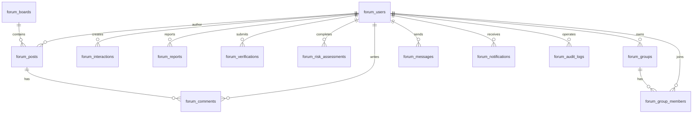

# 股票基金投资论坛数据库设计文档

## 1. 数据库概述

数据库用于支撑股票基金投资论坛核心业务，包括用户、认证、风险评估、板块、帖子、评论、互动、关注、举报、敏感词、群组、私信、通知、审计日志和证券代码联想。

迁移脚本：

```text
backend/src/main/resources/db/migration/V1__forum.sql
```

默认数据库：

```text
standalone
```

测试数据库：

```text
jdbc:h2:mem:stock_forum;MODE=MySQL;DATABASE_TO_LOWER=TRUE;DB_CLOSE_DELAY=-1
```

## 2. 命名规范

| 类型 | 规范 |
| --- | --- |
| 表名 | `forum_` 前缀，小写下划线 |
| 主键 | `id BIGINT PRIMARY KEY AUTO_INCREMENT` |
| 时间字段 | `created_at`、`updated_at`、业务动作时间 |
| 状态字段 | 使用 `VARCHAR(32)` 存储枚举 |
| JSON 列表 | 使用 `TEXT` 存储 JSON 字符串 |
| 布尔字段 | 使用 `BOOLEAN` |
| 索引名 | `idx_表名_字段` |
| 唯一约束 | `uk_表名_业务字段` |

## 3. ER 关系



## 4. 表清单

| 表名 | 说明 |
| --- | --- |
| `forum_users` | 用户账号、资料、角色、认证等级、积分等级 |
| `forum_boards` | 论坛板块 |
| `forum_posts` | 帖子、长文、投票、短动态 |
| `forum_comments` | 评论和楼中楼 |
| `forum_interactions` | 点赞、收藏、转发 |
| `forum_follows` | 关注、特别关注 |
| `forum_reports` | 用户举报 |
| `forum_sensitive_words` | 敏感词规则 |
| `forum_verifications` | 认证申请 |
| `forum_risk_assessments` | 投资者适当性评估 |
| `forum_groups` | 投资主题群组 |
| `forum_group_members` | 群组成员 |
| `forum_messages` | 私信 |
| `forum_notifications` | 通知 |
| `forum_audit_logs` | 后台审计日志 |
| `forum_stock_symbols` | 股票/基金代码联想 |

## 5. 表结构设计

### 5.1 forum_users

用户主表，保存账号、密码哈希、资料、角色、认证、适当性和成长体系。

| 字段 | 类型 | 约束 | 说明 |
| --- | --- | --- | --- |
| id | BIGINT | PK, AUTO_INCREMENT | 用户 ID |
| username | VARCHAR(64) | UNIQUE | 用户名 |
| phone | VARCHAR(32) | UNIQUE | 手机号 |
| email | VARCHAR(128) | UNIQUE | 邮箱 |
| password_hash | VARCHAR(256) | NOT NULL | 密码哈希 |
| password_salt | VARCHAR(128) | NOT NULL | 密码盐 |
| oauth_provider | VARCHAR(32) |  | 第三方账号平台 |
| oauth_open_id | VARCHAR(128) |  | 第三方账号 OpenID |
| nick_name | VARCHAR(64) | NOT NULL | 昵称 |
| avatar_url | VARCHAR(500) |  | 头像 |
| bio | VARCHAR(500) |  | 个人简介 |
| experience_tags | TEXT |  | 投资经验标签 JSON |
| markets | TEXT |  | 关注市场 JSON |
| risk_preference | VARCHAR(32) | NOT NULL, DEFAULT `BALANCED` | 风险偏好 |
| role | VARCHAR(32) | NOT NULL, DEFAULT `USER` | 角色 |
| verification_level | VARCHAR(32) | NOT NULL, DEFAULT `BASIC` | 认证等级 |
| professional_badge | BOOLEAN | NOT NULL, DEFAULT FALSE | 专业 V 标识 |
| suitability_status | VARCHAR(32) | NOT NULL, DEFAULT `NOT_STARTED` | 适当性评估状态 |
| privacy_profile | VARCHAR(32) | NOT NULL, DEFAULT `PUBLIC` | 资料可见范围 |
| status | VARCHAR(32) | NOT NULL, DEFAULT `ACTIVE` | 用户状态 |
| points | INT | NOT NULL, DEFAULT 0 | 积分 |
| user_level | INT | NOT NULL, DEFAULT 1 | 等级 |
| post_count | INT | NOT NULL, DEFAULT 0 | 发帖数 |
| digest_count | INT | NOT NULL, DEFAULT 0 | 精华数 |
| influence | INT | NOT NULL, DEFAULT 0 | 影响力 |
| created_at | DATETIME | NOT NULL | 创建时间 |
| updated_at | DATETIME | NOT NULL | 更新时间 |

索引：

| 名称 | 字段 | 说明 |
| --- | --- | --- |
| `idx_forum_users_role` | role | 角色筛选 |
| `idx_forum_users_status` | status | 用户状态筛选 |

### 5.2 forum_boards

板块表，支持动态添加、修改、停用。

| 字段 | 类型 | 约束 | 说明 |
| --- | --- | --- | --- |
| id | BIGINT | PK, AUTO_INCREMENT | 板块 ID |
| name | VARCHAR(64) | NOT NULL | 板块名称 |
| slug | VARCHAR(64) | NOT NULL, UNIQUE | 板块标识 |
| category | VARCHAR(64) | NOT NULL | 板块分类 |
| description | VARCHAR(500) |  | 板块描述 |
| market | VARCHAR(32) |  | 市场类型 |
| sort_order | INT | NOT NULL, DEFAULT 0 | 排序 |
| enabled | BOOLEAN | NOT NULL, DEFAULT TRUE | 启用状态 |
| created_at | DATETIME | NOT NULL | 创建时间 |
| updated_at | DATETIME | NOT NULL | 更新时间 |

索引：

| 名称 | 字段 | 说明 |
| --- | --- | --- |
| `idx_forum_boards_enabled_sort` | enabled, sort_order | 启用板块排序 |

### 5.3 forum_posts

帖子主表，承载普通帖子、长文、投票、短讨论。

| 字段 | 类型 | 约束 | 说明 |
| --- | --- | --- | --- |
| id | BIGINT | PK, AUTO_INCREMENT | 帖子 ID |
| author_id | BIGINT | NOT NULL | 作者用户 ID |
| board_id | BIGINT | NOT NULL | 板块 ID |
| type | VARCHAR(32) | NOT NULL | 帖子类型 |
| title | VARCHAR(160) | NOT NULL | 标题 |
| summary | VARCHAR(500) |  | 摘要 |
| content | TEXT | NOT NULL | 正文 |
| images | TEXT |  | 图片 JSON |
| attachments | TEXT |  | 附件 JSON |
| stock_codes | TEXT |  | 股票/基金代码 JSON |
| status | VARCHAR(32) | NOT NULL | 内容状态 |
| review_reason | VARCHAR(500) |  | 审核原因 |
| digest | BOOLEAN | NOT NULL, DEFAULT FALSE | 精华标识 |
| like_count | INT | NOT NULL, DEFAULT 0 | 点赞数 |
| favorite_count | INT | NOT NULL, DEFAULT 0 | 收藏数 |
| share_count | INT | NOT NULL, DEFAULT 0 | 转发数 |
| comment_count | INT | NOT NULL, DEFAULT 0 | 评论数 |
| view_count | INT | NOT NULL, DEFAULT 0 | 浏览数 |
| created_at | DATETIME | NOT NULL | 创建时间 |
| updated_at | DATETIME | NOT NULL | 更新时间 |
| published_at | DATETIME |  | 发布时间 |

索引：

| 名称 | 字段 | 说明 |
| --- | --- | --- |
| `idx_forum_posts_board_status` | board_id, status | 板块帖子列表 |
| `idx_forum_posts_author_status` | author_id, status | 用户帖子列表 |
| `idx_forum_posts_created` | created_at | 创建时间排序 |
| `idx_forum_posts_published` | published_at | 发布时间排序 |

### 5.4 forum_comments

评论表，支持楼中楼。

| 字段 | 类型 | 约束 | 说明 |
| --- | --- | --- | --- |
| id | BIGINT | PK, AUTO_INCREMENT | 评论 ID |
| post_id | BIGINT | NOT NULL | 帖子 ID |
| user_id | BIGINT | NOT NULL | 评论用户 ID |
| parent_id | BIGINT |  | 一级评论 ID |
| reply_to_id | BIGINT |  | 回复目标评论 ID |
| content | TEXT | NOT NULL | 评论内容 |
| status | VARCHAR(32) | NOT NULL, DEFAULT `PUBLISHED` | 评论状态 |
| like_count | INT | NOT NULL, DEFAULT 0 | 评论点赞数 |
| created_at | DATETIME | NOT NULL | 创建时间 |
| updated_at | DATETIME | NOT NULL | 更新时间 |

索引：

| 名称 | 字段 | 说明 |
| --- | --- | --- |
| `idx_forum_comments_post` | post_id, created_at | 帖子评论列表 |
| `idx_forum_comments_parent` | parent_id | 楼中楼查询 |

### 5.5 forum_interactions

互动表，保存点赞、收藏、转发。

| 字段 | 类型 | 约束 | 说明 |
| --- | --- | --- | --- |
| id | BIGINT | PK, AUTO_INCREMENT | 互动 ID |
| user_id | BIGINT | NOT NULL | 用户 ID |
| target_type | VARCHAR(32) | NOT NULL | 目标类型 |
| target_id | BIGINT | NOT NULL | 目标 ID |
| action | VARCHAR(32) | NOT NULL | 动作 |
| active | BOOLEAN | NOT NULL, DEFAULT TRUE | 是否有效 |
| created_at | DATETIME | NOT NULL | 创建时间 |
| updated_at | DATETIME | NOT NULL | 更新时间 |

约束与索引：

| 名称 | 字段 | 说明 |
| --- | --- | --- |
| `uk_forum_interactions` | user_id, target_type, target_id, action | 同一用户对同一目标同一动作唯一 |
| `idx_forum_interactions_target` | target_type, target_id, action, active | 目标互动统计 |

### 5.6 forum_follows

关注关系表。

| 字段 | 类型 | 约束 | 说明 |
| --- | --- | --- | --- |
| id | BIGINT | PK, AUTO_INCREMENT | 关注 ID |
| follower_id | BIGINT | NOT NULL | 关注者 |
| following_id | BIGINT | NOT NULL | 被关注者 |
| starred | BOOLEAN | NOT NULL, DEFAULT FALSE | 特别关注 |
| created_at | DATETIME | NOT NULL | 创建时间 |

约束与索引：

| 名称 | 字段 | 说明 |
| --- | --- | --- |
| `uk_forum_follows` | follower_id, following_id | 关注关系唯一 |
| `idx_forum_follows_following` | following_id | 粉丝查询 |

### 5.7 forum_reports

举报表。

| 字段 | 类型 | 约束 | 说明 |
| --- | --- | --- | --- |
| id | BIGINT | PK, AUTO_INCREMENT | 举报 ID |
| reporter_id | BIGINT | NOT NULL | 举报人 |
| target_type | VARCHAR(32) | NOT NULL | 举报目标类型 |
| target_id | BIGINT | NOT NULL | 举报目标 ID |
| reason | VARCHAR(128) | NOT NULL | 举报原因 |
| detail | VARCHAR(1000) |  | 举报详情 |
| status | VARCHAR(32) | NOT NULL, DEFAULT `OPEN` | 举报状态 |
| handled_by | BIGINT |  | 处理人 |
| handled_at | DATETIME |  | 处理时间 |
| created_at | DATETIME | NOT NULL | 创建时间 |

索引：

| 名称 | 字段 | 说明 |
| --- | --- | --- |
| `idx_forum_reports_status` | status, created_at | 举报处理队列 |

### 5.8 forum_sensitive_words

敏感词表。

| 字段 | 类型 | 约束 | 说明 |
| --- | --- | --- | --- |
| id | BIGINT | PK, AUTO_INCREMENT | 敏感词 ID |
| word | VARCHAR(128) | NOT NULL, UNIQUE | 敏感词 |
| category | VARCHAR(64) | NOT NULL | 分类 |
| enabled | BOOLEAN | NOT NULL, DEFAULT TRUE | 启用状态 |
| created_at | DATETIME | NOT NULL | 创建时间 |

### 5.9 forum_verifications

认证申请表。

| 字段 | 类型 | 约束 | 说明 |
| --- | --- | --- | --- |
| id | BIGINT | PK, AUTO_INCREMENT | 认证 ID |
| user_id | BIGINT | NOT NULL | 用户 ID |
| type | VARCHAR(32) | NOT NULL | 认证类型 |
| real_name | VARCHAR(64) |  | 真实姓名 |
| id_number | VARCHAR(64) |  | 身份证号 |
| provider | VARCHAR(64) |  | 服务商 |
| external_request_id | VARCHAR(128) |  | 外部请求 ID |
| materials | TEXT |  | 材料 JSON |
| status | VARCHAR(32) | NOT NULL, DEFAULT `PENDING` | 认证状态 |
| review_reason | VARCHAR(500) |  | 审核原因 |
| created_at | DATETIME | NOT NULL | 创建时间 |
| updated_at | DATETIME | NOT NULL | 更新时间 |

索引：

| 名称 | 字段 | 说明 |
| --- | --- | --- |
| `idx_forum_verifications_user_type` | user_id, type | 用户认证查询 |

### 5.10 forum_risk_assessments

风险评估表。

| 字段 | 类型 | 约束 | 说明 |
| --- | --- | --- | --- |
| id | BIGINT | PK, AUTO_INCREMENT | 评估 ID |
| user_id | BIGINT | NOT NULL | 用户 ID |
| score | INT | NOT NULL | 分数 |
| risk_level | VARCHAR(32) | NOT NULL | 风险等级 |
| answers | TEXT | NOT NULL | 答案 JSON |
| status | VARCHAR(32) | NOT NULL, DEFAULT `COMPLETED` | 评估状态 |
| created_at | DATETIME | NOT NULL | 创建时间 |

索引：

| 名称 | 字段 | 说明 |
| --- | --- | --- |
| `idx_forum_risk_user` | user_id, created_at | 用户风险评估记录 |

### 5.11 forum_groups

群组表。

| 字段 | 类型 | 约束 | 说明 |
| --- | --- | --- | --- |
| id | BIGINT | PK, AUTO_INCREMENT | 群组 ID |
| owner_id | BIGINT | NOT NULL | 创建者 |
| name | VARCHAR(80) | NOT NULL | 群组名称 |
| description | VARCHAR(500) |  | 群组描述 |
| visibility | VARCHAR(32) | NOT NULL, DEFAULT `PUBLIC` | 可见性 |
| join_policy | VARCHAR(32) | NOT NULL, DEFAULT `OPEN` | 加入策略 |
| member_count | INT | NOT NULL, DEFAULT 1 | 成员数 |
| created_at | DATETIME | NOT NULL | 创建时间 |
| updated_at | DATETIME | NOT NULL | 更新时间 |

索引：

| 名称 | 字段 | 说明 |
| --- | --- | --- |
| `idx_forum_groups_visibility` | visibility, created_at | 公开群组列表 |

### 5.12 forum_group_members

群组成员表。

| 字段 | 类型 | 约束 | 说明 |
| --- | --- | --- | --- |
| id | BIGINT | PK, AUTO_INCREMENT | 成员关系 ID |
| group_id | BIGINT | NOT NULL | 群组 ID |
| user_id | BIGINT | NOT NULL | 用户 ID |
| role | VARCHAR(32) | NOT NULL, DEFAULT `MEMBER` | 群内角色 |
| status | VARCHAR(32) | NOT NULL, DEFAULT `ACTIVE` | 成员状态 |
| created_at | DATETIME | NOT NULL | 加入时间 |

约束：

| 名称 | 字段 | 说明 |
| --- | --- | --- |
| `uk_forum_group_members` | group_id, user_id | 同一用户在同一群组唯一 |

### 5.13 forum_messages

私信表。

| 字段 | 类型 | 约束 | 说明 |
| --- | --- | --- | --- |
| id | BIGINT | PK, AUTO_INCREMENT | 私信 ID |
| sender_id | BIGINT | NOT NULL | 发送者 |
| receiver_id | BIGINT | NOT NULL | 接收者 |
| content | TEXT | NOT NULL | 文本内容 |
| image_url | VARCHAR(500) |  | 图片 URL |
| read_at | DATETIME |  | 阅读时间 |
| created_at | DATETIME | NOT NULL | 创建时间 |

索引：

| 名称 | 字段 | 说明 |
| --- | --- | --- |
| `idx_forum_messages_pair` | sender_id, receiver_id, created_at | 双方会话查询 |
| `idx_forum_messages_receiver` | receiver_id, read_at | 收件箱和未读查询 |

### 5.14 forum_notifications

通知表。

| 字段 | 类型 | 约束 | 说明 |
| --- | --- | --- | --- |
| id | BIGINT | PK, AUTO_INCREMENT | 通知 ID |
| user_id | BIGINT | NOT NULL | 接收用户 |
| type | VARCHAR(32) | NOT NULL | 通知类型 |
| title | VARCHAR(160) | NOT NULL | 标题 |
| content | VARCHAR(1000) |  | 内容 |
| read_at | DATETIME |  | 阅读时间 |
| created_at | DATETIME | NOT NULL | 创建时间 |

索引：

| 名称 | 字段 | 说明 |
| --- | --- | --- |
| `idx_forum_notifications_user` | user_id, read_at, created_at | 用户通知列表 |

### 5.15 forum_audit_logs

后台审计日志表。

| 字段 | 类型 | 约束 | 说明 |
| --- | --- | --- | --- |
| id | BIGINT | PK, AUTO_INCREMENT | 日志 ID |
| operator_id | BIGINT | NOT NULL | 操作人 |
| action | VARCHAR(64) | NOT NULL | 操作类型 |
| target_type | VARCHAR(32) | NOT NULL | 目标类型 |
| target_id | BIGINT | NOT NULL | 目标 ID |
| detail | VARCHAR(1000) |  | 详情 |
| created_at | DATETIME | NOT NULL | 创建时间 |

索引：

| 名称 | 字段 | 说明 |
| --- | --- | --- |
| `idx_forum_audit_target` | target_type, target_id | 目标审计记录 |

### 5.16 forum_stock_symbols

股票/基金代码基础数据表。

| 字段 | 类型 | 约束 | 说明 |
| --- | --- | --- | --- |
| id | BIGINT | PK, AUTO_INCREMENT | 证券 ID |
| code | VARCHAR(32) | NOT NULL, UNIQUE | 代码 |
| name | VARCHAR(128) | NOT NULL | 名称 |
| market | VARCHAR(32) | NOT NULL | 市场 |
| aliases | VARCHAR(500) |  | 别名 |

索引：

| 名称 | 字段 | 说明 |
| --- | --- | --- |
| `idx_forum_stock_name` | name | 名称搜索 |

## 6. 业务状态设计

用户状态：

| 值 | 说明 |
| --- | --- |
| `ACTIVE` | 正常 |
| `MUTED` | 禁言 |
| `BANNED` | 封禁 |

用户角色：

| 值 | 说明 |
| --- | --- |
| `USER` | 普通用户 |
| `PRO_USER` | 专业用户 |
| `MODERATOR` | 运营/版主 |
| `ADMIN` | 管理员 |

帖子状态：

| 值 | 说明 |
| --- | --- |
| `DRAFT` | 草稿 |
| `PENDING_REVIEW` | 待审核 |
| `PUBLISHED` | 已发布 |
| `REJECTED` | 已拒绝 |
| `DELETED` | 已删除 |

认证状态：

| 值 | 说明 |
| --- | --- |
| `PENDING` | 待审核 |
| `APPROVED` | 已通过 |
| `REJECTED` | 已拒绝 |

举报状态：

| 值 | 说明 |
| --- | --- |
| `OPEN` | 待处理 |
| `RESOLVED` | 已处理 |

## 7. 初始化数据

Flyway 初始化数据包括：

- 默认板块：A股市场、港股市场、美股市场、基金投资、价值投资、量化投资、新股新债、宏观策略、公司研究、问答求助。
- 默认敏感词：稳赚、内幕消息、操纵市场、保本收益。
- 默认证券代码：600519、000300、00700、AAPL、SPY、510300。

应用启动种子数据包括：

- 管理员：`admin / forum-admin-2026`
- 专业用户：`analyst / analyst123`
- 普通用户：`investor / investor123`
- 示例已发布帖子。

## 8. 主要查询路径

| 业务 | 主要表 | 使用索引 |
| --- | --- | --- |
| 首页 Feed | `forum_posts` | `idx_forum_posts_published` |
| 板块帖子 | `forum_posts` | `idx_forum_posts_board_status` |
| 我的帖子 | `forum_posts` | `idx_forum_posts_author_status` |
| 评论列表 | `forum_comments` | `idx_forum_comments_post` |
| 互动状态 | `forum_interactions` | `uk_forum_interactions`、`idx_forum_interactions_target` |
| 关注动态 | `forum_follows` + `forum_posts` | `idx_forum_follows_following`、`idx_forum_posts_author_status` |
| 举报队列 | `forum_reports` | `idx_forum_reports_status` |
| 公开群组 | `forum_groups` | `idx_forum_groups_visibility` |
| 私信会话 | `forum_messages` | `idx_forum_messages_pair` |
| 用户通知 | `forum_notifications` | `idx_forum_notifications_user` |
| 股票联想 | `forum_stock_symbols` | `idx_forum_stock_name` |

## 9. 数据一致性规则

| 场景 | 一致性处理 |
| --- | --- |
| 发帖 | 写入帖子后增加用户 `post_count`、`points`、`influence` |
| 评论 | 写入评论后增加帖子 `comment_count` |
| 点赞/收藏/转发 | 写入或更新互动记录后同步维护帖子计数 |
| 加入群组 | 写入群组成员后增加 `member_count` |
| 审核帖子 | 更新帖子状态和发布时间，写入审计日志 |
| 处理举报 | 更新举报状态和处理人，写入审计日志 |
| 违规处理 | 更新用户状态，写入通知和审计日志 |
| 风险评估 | 写入评估记录后更新用户 `suitability_status` 和 `risk_preference` |
